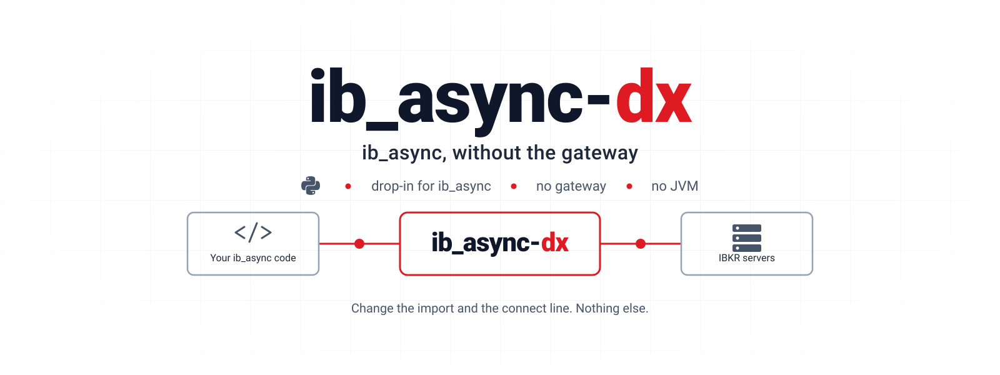
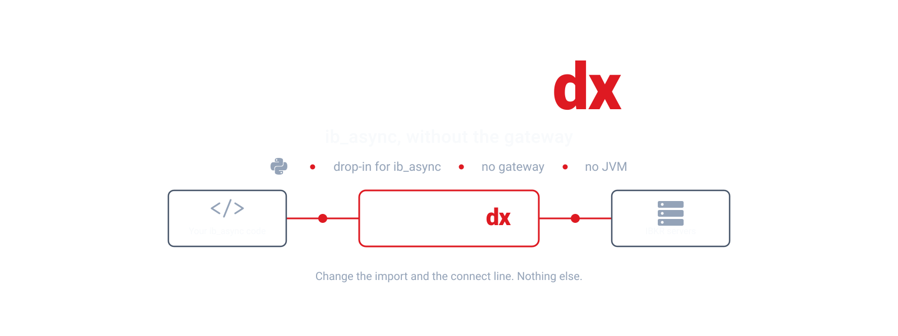

<div class="dx-hero">

<h1 class="dx-title">ib_async-dx</h1>




<p class="dx-lede">ib_async without the gateway. The program you already wrote against ib_async, with no IB Gateway, no Trader Workstation and no JVM between it and the venue.</p>

<p class="dx-cta">
  <a class="dx-primary" href="./getting-started.html">Get started</a>
  <a href="./drop-in.html">What drop-in means</a>
  <a href="./notebooks.html">Notebooks</a>
  <a href="https://github.com/userFRM/ib_async-dx">GitHub</a>
</p>

</div>

## Two lines change

A program written against [ib_async](https://github.com/ib-api-reloaded/ib_async)
talks to IB Gateway or Trader Workstation over a socket on localhost, and that
process talks to the venue. ib_async-dx puts the
[ibkr-dx](https://github.com/userFRM/ibkr-dx) engine where the gateway was: it
logs in, holds the trading, market-data, historical and security-definition
connections open, and answers every call ib_async makes.

```diff
- from ib_async import IB, Stock
+ from ib_async_dx import IB, Stock

  ib = IB()
- ib.connect("127.0.0.1", 4001, clientId=1)    # a gateway on localhost
+ ib.connect(username="...", password="...")   # a paper session; paper=False for live
```

That is the whole change. `ib_async_dx` is ib_async: the same names, the same
objects and the same submodules, run by ib_async's own code, installed as a
dependency. Two classes differ: `IB`, a subclass of ib_async's whose `connect`
takes a login instead of a gateway's address, and `IBC`, which has no gateway
to start. The rest of the program — its events, its `*Async` calls, its
`Ticker` and `Trade`, its `util` — runs unmodified, with the engine in place of
the one layer that knew there was a socket.

> [!TIP]
> Leave the credentials out of `connect` and it reads `IB_USERNAME` and
> `IB_PASSWORD` from the environment. Where those are set, the connect line can
> stay exactly as it was for a paper account: the host and port are not used,
> and the client id is carried into the login. The port does not choose paper
> or live; add `paper=False` for a live account.

## What goes away

<div class="dx-cards">
<div class="dx-card">
<p class="dx-card-title">The gateway</p>
<p>Nothing to install, launch, log into on a schedule, or restart. No window either: it runs in a container, over ssh, on a machine with no display.</p>
</div>
<div class="dx-card">
<p class="dx-card-title">The JVM</p>
<p>No heap to size, and no JVM garbage collector pausing the process your ticks pass through.</p>
</div>
<div class="dx-card">
<p class="dx-card-title">The localhost socket</p>
<p>The engine runs inside your Python process. Nothing listens on a port, and ticks are delivered in-process.</p>
</div>
<div class="dx-card">
<p class="dx-card-title">IBC and the watchdog</p>
<p>No login window to script and no gateway to restart when it wedges. The engine logs in itself, and rebuilds a dropped connection on the session it already holds. ib_async's own <code>Watchdog</code> still runs, as a reconnect loop, with the login its <code>IBC</code> names.</p>
</div>
</div>

## What you get

<div class="dx-cards">
<div class="dx-card">
<p class="dx-card-title">ib_async, exactly</p>
<p><code>ib_async_dx</code> exports ib_async's 103 names, and every one but <code>IB</code> and <code>IBC</code> is ib_async's own object, its <code>__version__</code> among them. A test holds the two packages to that on every run.</p>
</div>
<div class="dx-card">
<p class="dx-card-title">Every call it makes, carried</p>
<p>ib_async's <code>IB</code> makes 67 calls on its transport at 2.1.0, and every one lands on the engine. A test reads that list out of ib_async's own source on every run.</p>
</div>
<div class="dx-card">
<p class="dx-card-title">Nothing in between</p>
<p>The engine is compiled Rust, running in your process through <a href="https://pyo3.rs">PyO3</a>. There is no second process that can be wedged while your program looks healthy.</p>
</div>
<div class="dx-card">
<p class="dx-card-title">More than a gateway forwards</p>
<p>What the venue states that no documented call asks for — the order types the account may use, its algorithms, the features it has enabled, the whole option model — is a method on <code>IB</code>. <a href="./beyond.html">Beyond ib_async</a> lists them, with the four ib_async bugs fixed here.</p>
</div>
<div class="dx-card">
<p class="dx-card-title">Honest about its limits</p>
<p>A field the engine cannot carry is refused, as a gateway refuses a message it cannot read, instead of going out as something other than what was asked. The few things taken and not applied, and everything else that differs from ib_async over a gateway, are <a href="./limits.html">written down</a> with the reason for each.</p>
</div>
</div>

## Where to go next

<div class="dx-cards">
<a class="dx-card" href="./getting-started.html"><strong>Getting started</strong><span>Install, credentials, and a first program.</span></a>
<a class="dx-card" href="./drop-in.html"><strong>What drop-in means</strong><span>The promise, the connect line, and how it is proven.</span></a>
<a class="dx-card" href="./bridge.html"><strong>Running ib_async itself</strong><span>ib_async's own code, with the engine where its socket was, and what that carries.</span></a>
<a class="dx-card" href="./beyond.html"><strong>Beyond ib_async</strong><span>Four bugs fixed, and the calls ib_async has no name for.</span></a>
<a class="dx-card" href="./notebooks.html"><strong>The notebooks</strong><span>All eight of ib_async's notebook subjects, run with no gateway.</span></a>
<a class="dx-card" href="./limits.html"><strong>Before you depend on it</strong><span>What differs from ib_async over a gateway, and what is not carried and why.</span></a>
<a class="dx-card" href="./evidence.html"><strong>What it rests on</strong><span>The tests, the scripts and the sessions behind each claim.</span></a>
</div>

## Status

Under active development. The Python package is here with its suite: 300
tests, 298 of which run offline on every push to `main` and every pull
request, on Python 3.11, 3.13 and free-threaded 3.14t, and 2 that need a live
login. ib_async's own
suite is written to run against the engine too, and has not been run against
the venue at this revision; see [Evidence](./evidence.md).

A Rust client — ib_async's model in Rust spelling, on the engine's public API —
is coming. It is not in this repository yet.

Neither ib_async-dx nor the engine is published to PyPI or crates.io yet; both
install from their repositories: see [Getting started](./getting-started.md).

> [!NOTE]
> An independent project. It is not affiliated with ib_async or its
> maintainers, nor with Interactive Brokers. ib_async-dx runs ib_async's own
> code as a dependency and does not copy it. ib_async is BSD-2-Clause, and
> ib_async-dx is AGPL-3.0.
